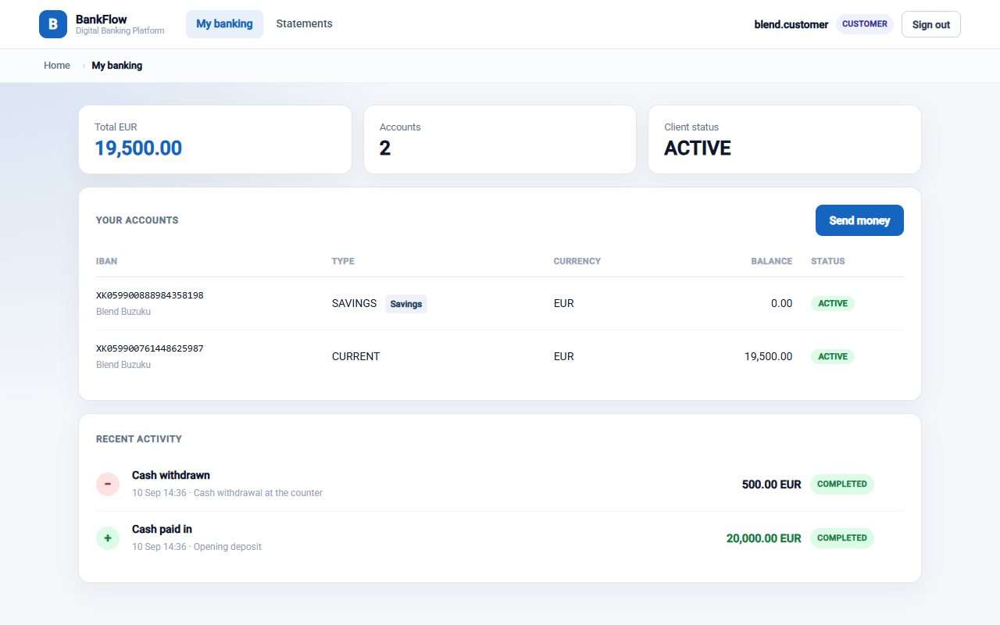
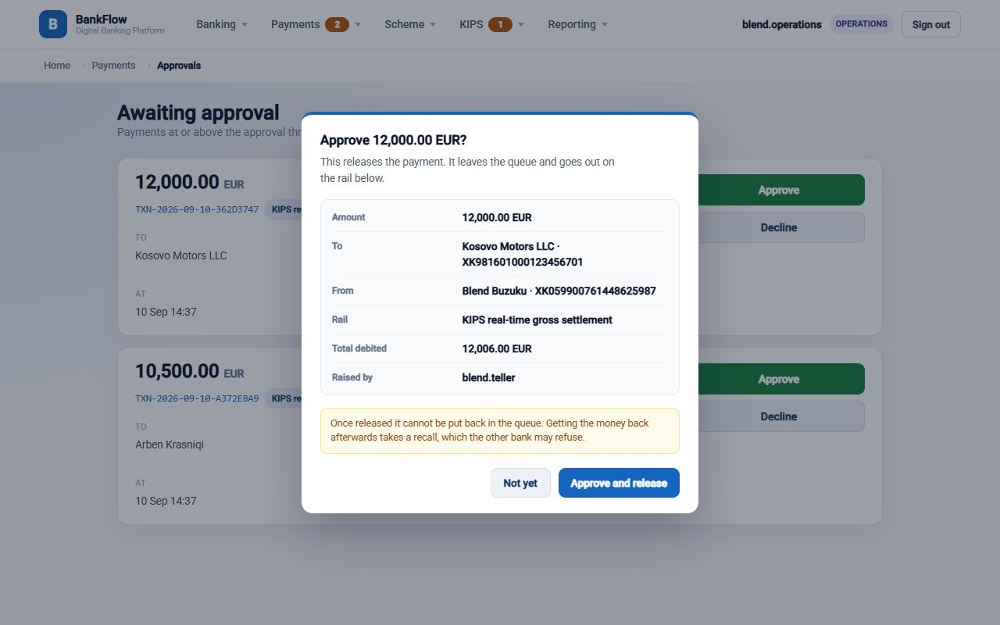
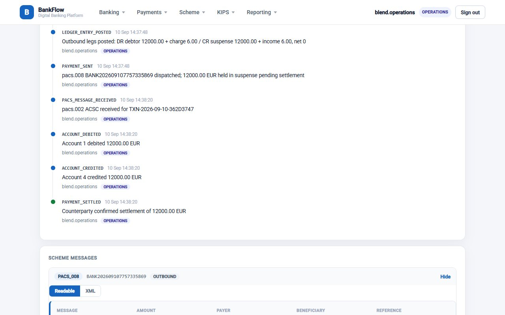
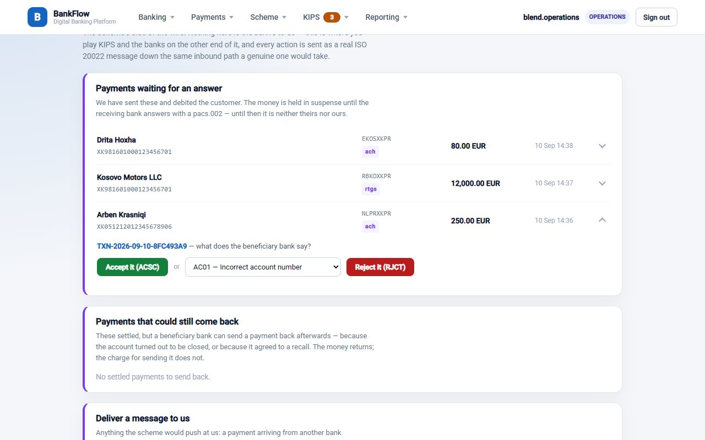
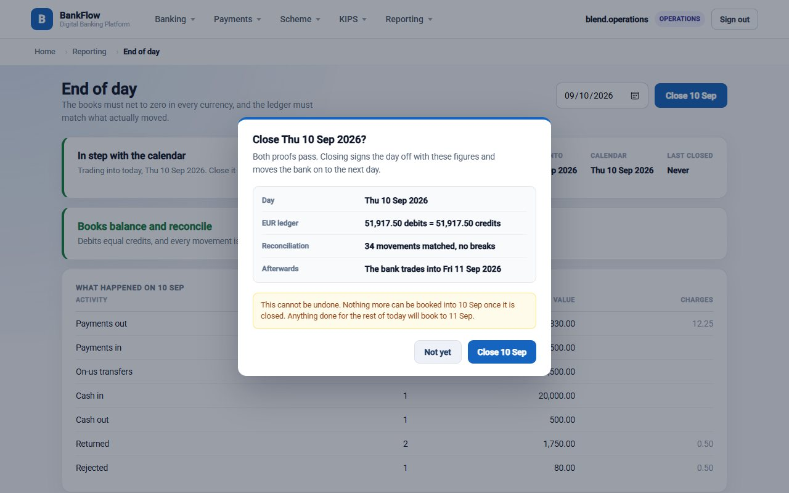
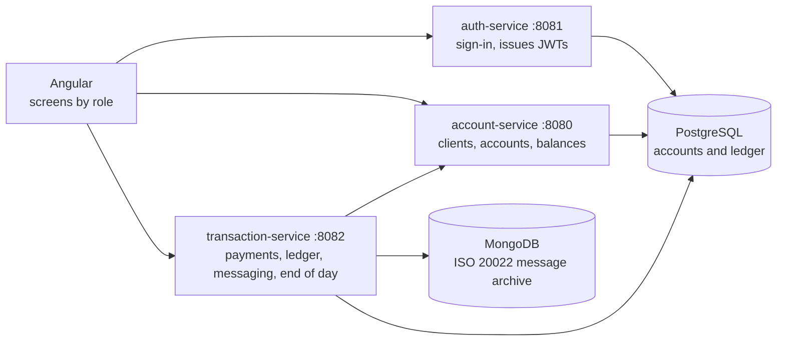

# BankFlow

A core banking application: a retail bank that sends and receives payments through
Kosovo's national payment system (KIPS), simulated end to end. Customers, tellers,
operations staff and administrators each get their own screens.



## Screens

| | |
|---|---|
|  |  |
| **Approvals.** Large payments wait for a second person before any money moves. | **Payment messages.** Each payment's ISO 20022 message, readable next to the raw XML. |
|  |  |
| **Test console.** Plays the other banks, so every flow can be run end to end. | **End of day.** The day closes only once the ledger balances. |

## How it works

Three Spring Boot services behind one Angular front end, talking over REST.



- **ISO 20022 messaging.** Builds and parses the XML behind every payment, status report,
  return, recall and statement (pacs.008, pacs.002, pacs.004, camt.056, camt.029, camt.053),
  and validates each message against KIPS's official XSD schemas, going out and coming in.
- **Double-entry ledger.** Every movement posts as balanced debit and credit legs with an
  audit trail. Money in flight waits in suspense accounts until the scheme settles or
  rejects it, so nothing is ever half-moved.
- **Payment routing.** Routes each payment as on-us, outbound or inbound across KIPS's ACH
  and RTGS schemes, applying each scheme's rules and the bank's fee tariffs.
- **Consistency.** Account rows are locked with `PESSIMISTIC_WRITE` while a payment posts,
  so two payments at once can't spend the same balance. Money is `BigDecimal` throughout,
  and Flyway migrations own the schema, with Hibernate only validating it.
- **Security and controls.** Stateless JWT authentication with role-based access; the
  services call each other with their own service token. Payments above a per-currency
  limit wait for a second person, and whoever made a payment can never approve it.
- **End of day.** The day closes on the bank's business calendar, not the server clock.
  It refuses to close unless the trial balance nets to zero in every currency, and a
  closed day can't take new postings.

## Tech stack

Java 21 · Spring Boot 4 · Spring Security · JPA / Hibernate · Flyway · PostgreSQL ·
MongoDB · Angular · TypeScript · JWT · ISO 20022 XML

## Running it locally

You need Java 21, Node.js, PostgreSQL and MongoDB running on your machine.

1. Create a PostgreSQL database called `bankflow`. Flyway creates the tables on first start.
2. Set these environment variables (see `.env.example`):

   | Variable | Example |
   |---|---|
   | `DB_URL` | `jdbc:postgresql://localhost:5432/bankflow` |
   | `DB_USERNAME` | `postgres` |
   | `DB_PASSWORD` | your database password |
   | `JWT_SECRET` | a long random string, the same for all three services |
   | `MONGO_URI` | optional, defaults to `mongodb://localhost:27017/bankflow` |

3. Install the shared module, then start each service in its own terminal:

   ```bash
   cd backend/common && ./mvnw install
   cd backend/auth-service && ./mvnw spring-boot:run
   cd backend/account-service && ./mvnw spring-boot:run
   cd backend/transaction-service && ./mvnw spring-boot:run
   ```

4. Start the front end and open http://localhost:4200:

   ```bash
   cd frontend && npm install && npm start
   ```

Signing up creates a customer. To try the staff screens, give a user another role in the
database, one of `TELLER`, `OPERATIONS` or `BANK_ADMIN`:

```sql
UPDATE users SET role = 'BANK_ADMIN' WHERE username = 'your-username';
```
